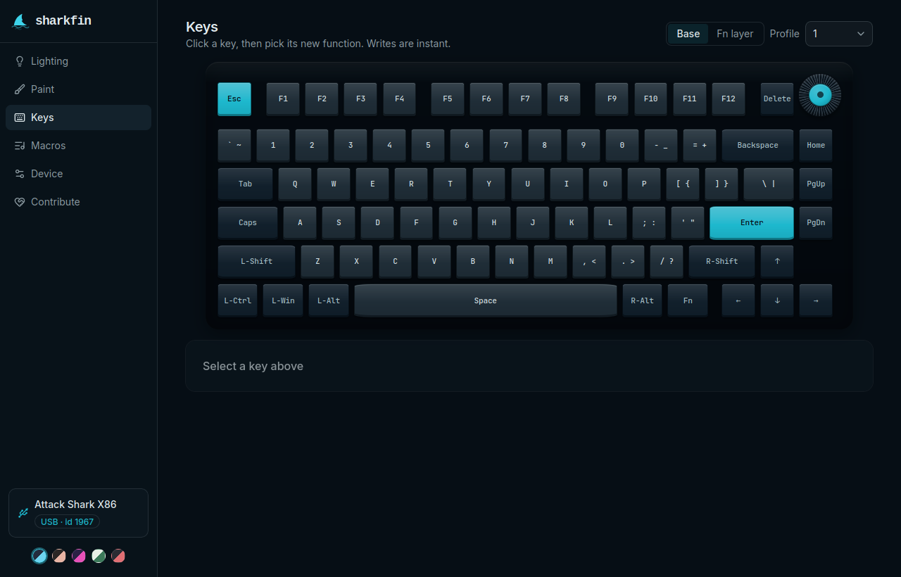
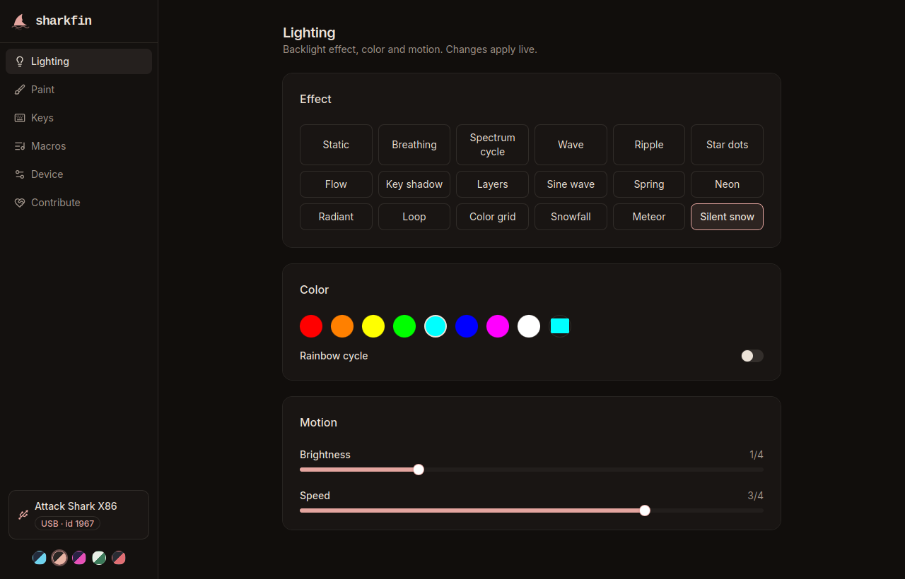

<p align="center">
  
</p>

<h1 align="center">sharkfin</h1>

<p align="center">
  Open-source configurator for Attack Shark and other ROYUAN keyboards.<br/>
  Linux, Windows, macOS, or straight from a Chromium browser.
</p>

<p align="center">
  <a href="https://github.com/dniminenn/sharkfin/actions/workflows/ci.yml"></a>
  
  
  
</p>



Remap keys, set the RGB, record macros and change device settings on 949
keyboards built on ROYUAN hardware: Attack Shark, Hator, ikbc, NOPPOO,
Epomaker, Akko, MEETION, rongyuan and more.

**Use a USB cable or the 2.4 GHz receiver.** Bluetooth has no settings
channel. Factory reset and display pictures need the cable. sharkfin never flashes firmware.

**[Use it in a browser](https://app.getsharkfin.com/) ·
[Download](https://github.com/dniminenn/sharkfin/releases) ·
[Is my board supported?](docs/BOARDS.md)**

## Supported boards

**Alpha, so back up first.**

952 of 956 accept changes, 4 are read-only. 187 are drawn out of the box
and 739 more after a one-time check against your board; the rest show a
slot grid.

The check exists because two boards can share one picture and still
disagree about which slot each key lives in, and a wrong guess sends a
remap to the wrong key. So sharkfin trusts your keyboard over its own
files: the picture is matched against your board's keymap and stays
read-only until you confirm it. A picture ships built in only when every
board sharing it agrees.

If your board shows the grid, or the picture is wrong, draw it on
[keyboard-layout-editor.com](http://www.keyboard-layout-editor.com) and
paste the drawing into the Keys page. Sending the result back gets the
board drawn for everyone who owns one.

## Features

- **Keys.** Remap any key, on a picture of your board, per profile. Base
  and Fn layers, combos, and the knob (turn left, turn right, press). Writes
  go to the keyboard immediately.
- **Lighting.** 18 effects with direction options, full RGB, brightness and
  speed. Sliders preview as you drag and write when you let go, because the
  keyboard keeps its lighting in flash. Edge-light controls appear on boards
  that have edge LEDs.
- **Paint.** Colour individual keys, then send. Sending is manual and
  rate-limited, because the pattern goes into the keyboard's flash.
- **Macros.** Record key and mouse sequences with per-event delays into the
  50 onboard slots, then bind a key to one: repeat, toggle, or while-held.
- **Profiles.** Three of them, onboard.
- **Backup.** Export everything to a file and restore it later.
- **Device.** Debounce, Windows-key lock, WASD/arrow swap, backlight off,
  host-OS auto-detect, sleep timeouts, factory reset.
- **Colorways.** The whole app re-skins like a keycap set swap: Abyss,
  Olivia, Laser, Botanical, 8008.



No cloud, no telemetry, no background services. The desktop app is one
binary and works offline; the browser build is a static page that talks to
nothing but your keyboard. There's no report-rate setting because this
hardware doesn't have one.

## Install

Nothing to install: open **[app.getsharkfin.com](https://app.getsharkfin.com/)**
in Chrome, Edge or another Chromium browser and plug the keyboard in. The
page reaches only the keyboard's settings channel and never sees your typing.
It keeps working without a connection after the first visit, and the browser
can install it as an app.

For the desktop app, download a release or build it yourself:

```sh
cd app
npm install
npm run tauri build
```

The browser build needs the wasm toolchain
(`rustup target add wasm32-unknown-unknown`, plus
[wasm-pack](https://rustwasm.github.io/wasm-pack/)):

```sh
cd app
npm install
npm run web:build   # -> app/dist-web
```

On Linux the keyboard's device node belongs to root, so sharkfin needs a
udev rule, browser build included. The .deb, .rpm and Arch packages
install it; replug the keyboard after installing. For the AppImage or the
browser, one line, then replug:

```sh
echo 'SUBSYSTEM=="hidraw", ATTRS{idVendor}=="3151|379a|374a|38a9|046a|2ea8|145f", MODE="0660", TAG+="uaccess"' \
  | sudo tee /etc/udev/rules.d/70-sharkfin.rules >/dev/null \
  && sudo udevadm control --reload-rules && sudo udevadm trigger
```

A rule from VIA, Vial or a vendor package may already cover it. The app
shows this command when it finds a keyboard it cannot open.

## If the keyboard stops responding

It happens: the firmware stops answering, and the app says the board needs a
replug. Typing still works. In order:

1. **Close sharkfin**, or the browser tab. While it's open it keeps trying to
   reach the board.
2. **Unplug the cable, wait ten seconds, plug it back in.** It needs to lose
   power, not just reconnect.
3. **Fn + Home** turns the lighting back on if the backlight is dead.
4. **Fn + Esc**, held for about three seconds, resets the board's settings.
5. Still wrong? Open sharkfin and use **Device, then Factory reset**.

None of this touches firmware, and nothing here can leave the board
unusable.

## Contributing

Bugs and board reports both start in the app's **Contribute** tab, which
collects a read-only data bundle to paste into an issue. Development setup
is in [CONTRIBUTING.md](CONTRIBUTING.md); the wire protocol is in
[docs/PROTOCOL.md](docs/PROTOCOL.md).

## License

GPL-3.0-or-later. sharkfin is an independent project, not affiliated with
or endorsed by Attack Shark, ROYUAN or any keyboard brand.
